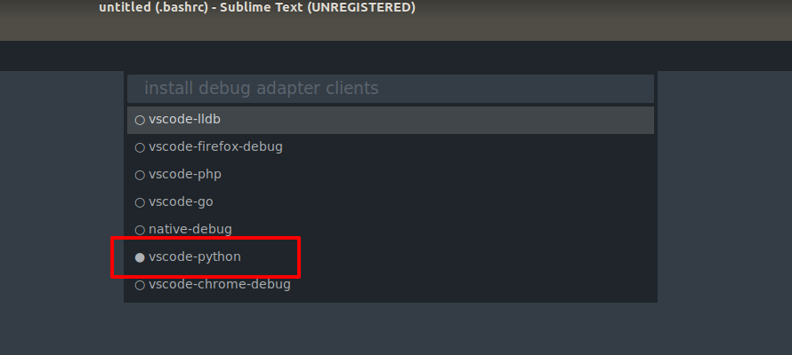
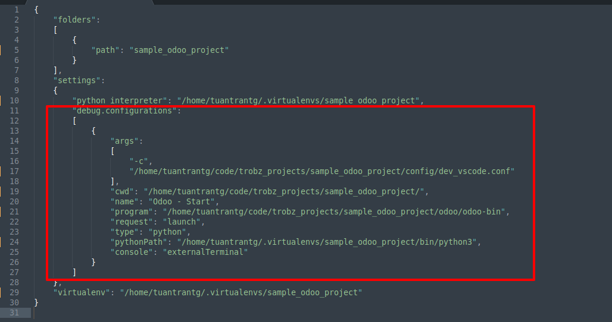
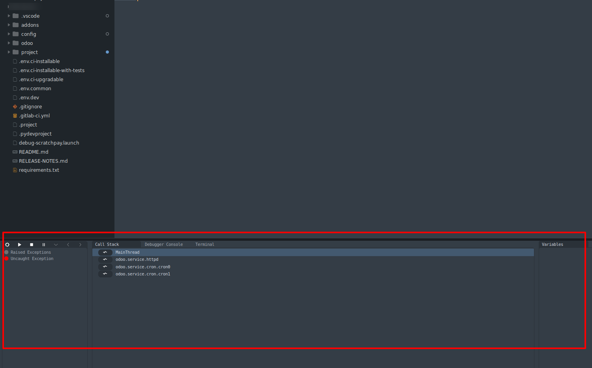

# How to Debug Odoo by VSCode

#### Please read this
- Before you read the following sections, you need a Ubuntu machine (real or virtual machine, it's up to you)
  - You can use any OS to do. But in this guide, I use the Ubuntu
- To use the Sublime Text to run or debug the Odoo, you need to know some things:
  - Odoo needs a environment to run -> We will use the virtual environment in [this guide](https://github.com/tuantrantg/how-to-setup-the-odoo-simple-development-envinroment/blob/master/README.md) to run Odoo by the VSCode
  - Odoo also needs a PostgreSQL server, please "google" to setup a PostgreSQL server if you don't have it on your machine
  - Sublime Text must be installed on your machine & you must install the ***sublime_debugger*** package. Here is [the link to download this package](https://github.com/daveleroy/sublime_debugger)

#### Prepare the debug configuration
- Install the package above to your Sublime Text
- In the project folder, create the new sublime project if you've not created it yet
  - Go to the menu ***"Debugger > Open"*** to create the new sublime project
- Install ***the Python debug adapter client*** if you've not installed it yet
  - Go to the menu ***"Debugger > Install Adapters"***, choose the `vscode-python` to install the debug adapter for Python



- It's time to create the new debug configuration (likes VSCode)
  - Go to the menu ***"Debugger > Change Configuration"***
  - If you don't have any the debug configurations, let's create the new one by click on the ***Add new configuration***


  - Here is the sample debug configuration of the Odoo project



  - And this one is my final debug configuration ;)


- In the above image, we will focus ***2 important parameters***: `program` and `args`
  - `program`: This is the path of the `odoo-bin` file of Odoo. If you don't have it, you can NOT run. It's simple :D
  - `args`: This is the specical parameter
    - In this parameter, you will specify ***the Odoo config file*** to run the Odoo, if you do NOT have the Odoo config file, you must declare the Odoo arguments to in here.
    - Please notice that
      - I use `"-c"` and `"/dir/to/config/dev.conf"` to specify the Odoo config file.
      - I use `"-u"` and `"sample_module"` to specify which module needs to upgrade
      - I use `"-d"` and `"sample_db_01"` to specify which database needs to upgrade
- Here is the sample (text version) of 2 Odoo debug configurations in the `sublime-project` file:

```
{
	"folders":
	[
		{
			"path": "sample_odoo_project"
		}
	],
	"settings":
	{
		"python_interpreter": "/home/tuantrantg/.virtualenvs/sample_odoo_project",
		"debug.configurations":
		[
			{
				"args":
				[
					"-c",
					"/home/tuantrantg/code/trobz_projects/sample_odoo_project/config/dev_vscode.conf"
				],
				"cwd": "/home/tuantrantg/code/trobz_projects/sample_odoo_project/",
				"name": "Odoo - Start",
				"program": "/home/tuantrantg/code/trobz_projects/sample_odoo_project/odoo/odoo-bin",
				"request": "launch",
				"type": "python",
				"pythonPath": "/home/tuantrantg/.virtualenvs/sample_odoo_project/bin/python3",
				"console": "externalTerminal"
			},
			{
				"args":
				[
					"-c",
					"/home/tuantrantg/code/trobz_projects/sample_odoo_project/config/dev_vscode.conf",
					"-u", "sample_module",
                	"-d", "sample_db_01",
				],
				"cwd": "/home/tuantrantg/code/trobz_projects/sample_odoo_project/",
				"name": "Odoo - Upgrade",
				"program": "/home/tuantrantg/code/trobz_projects/sample_odoo_project/odoo/odoo-bin",
				"request": "launch",
				"type": "python",
				"pythonPath": "/home/tuantrantg/.virtualenvs/sample_odoo_project/bin/python3",
				"console": "externalTerminal"
			}
		]
	},
	"virtualenv": "/home/tuantrantg/.virtualenvs/sample_odoo_project"
}

```

#### It's time to DEBUGGGGGGGG!!!
- After you save the debug configuration. you can debug right now by going to the menu ***Debugger > Start***


