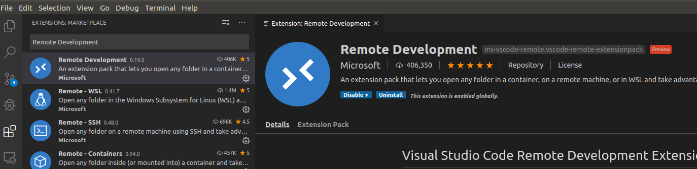
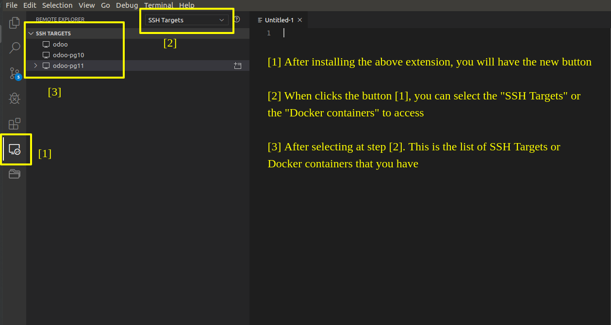
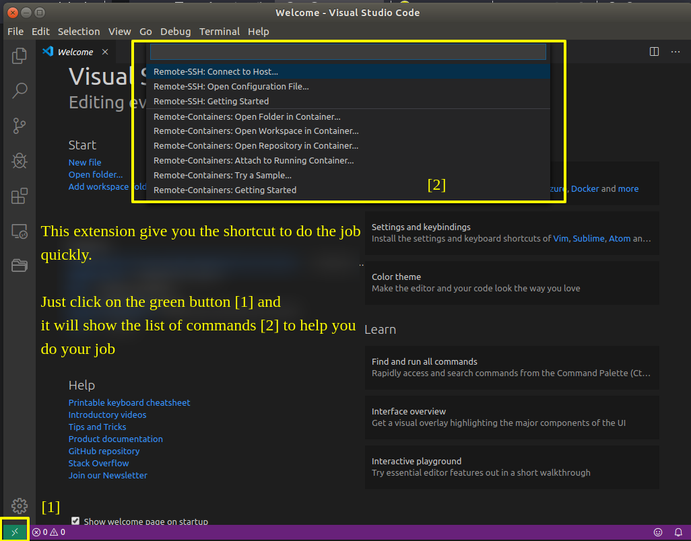
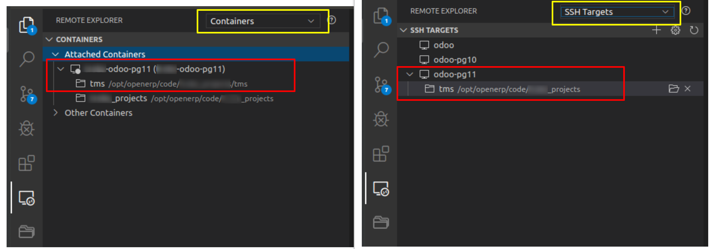
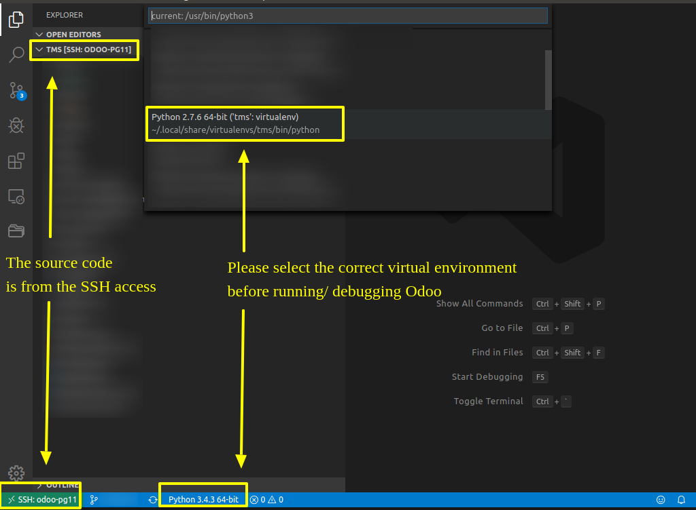

# How to access the SSH server access or the Docker container by the VSCode

#### Please read this
- This is the interesting guide, my colleague's explored this and I will introduce this guy in the ***Author's notes*** section
- Before you read the following sections, you need to ask yourself, "Why I need to read this?". And, you need to read this because:
  - You don't need to use the termnial to do the SSH accesss or Docker container access anymore (Just a few clicks to access ;) )
  - You just configure one time and use any time
  - You will have the simple GUI to use
  - You can manage the SSH targets/ Docker containters & code in only 1 application (it's VSCode, awesome :D )
  - ...
- So, if you want to go deeper. Let's start!

#### Prepare yourself!
- Open your VSCode and open the Extentions section
- Search the ***Remote Development*** extension and install it

- This image will introduce the basis

- Just try to click the above commands to see the awesome things

- You can read more the usage or the instruction of this extention by selecting this extension in the Extension section of the VSCode

#### The deeper thing is in here ;)
- The target of this guide is giving you the idea to use this extension to run/debug Odoo in the SSH server/ Docker container. I know there are a lot of Odoo's Docker images. This extension will help you manage and make your job easier.
- I suppose that you have a Docker container. This Docker container is the SSH server too ;) You can use this extension to access to the Docker container or just use the SSH access to this Docker container. The results will be the same, you will connect to the same source code.

- The only thing you can do is configuring to run/ debug based on [this guide](https://github.com/tuantrantg/how-to-setup-the-odoo-simple-development-envinroment/blob/master/DEBUG_ODOO_BY_VSCODE.md)

- NOTICE: 
  - If the VSCode can **NOT** recognize the virtual environments in the SSH server/ Docker containers, please go to the menu: ***File > Preferences > Settings*** to open the Settings and add **your virtual environment path** to the ***Python: Venv Path*** section
  - If you use VSCode + WSL + Docker remember redirect the path to your ./ssh folder at wsl:
    1. Make sure "Remote – SSH" extension is installed
    2. Create a bat file in bin folder on your windows(say C:\Users\<username>\bin), put this single line in it
        `C:\Windows\system32\wsl.exe ssh %*`
    3. Then, in VSCode settings(installed on Windows ofcourse), set remote.ssh.path to:
        `C:\Users\<username>\bin\ssh.bat`
    4. Done, now you'll have the same SSH configuration and credentials in VSCode as WSL

- Please remember that:
  - You can run Odoo if you have 2 things:
    - ***The environment to run Odoo***
    - ***And the PostgreSQL***
  - I don't mention **the Odoo source code** because you MUST have them to run Odoo, right? ;)

#### Author's notes
A ***special thanks*** goes to ***Pham Khac Cuong - CuongPK (cuongpk.nt@gmail.com)*** who explores & supports me to complete this guide ;)
